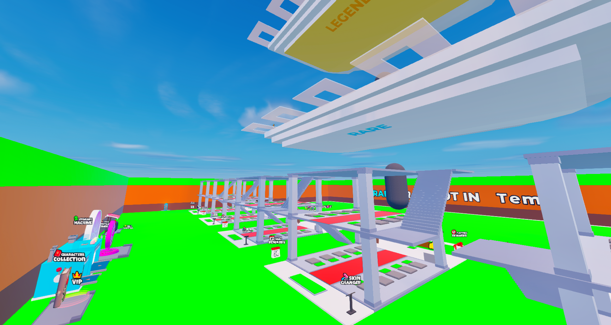
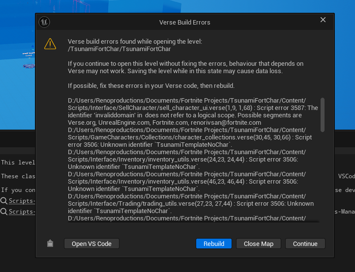
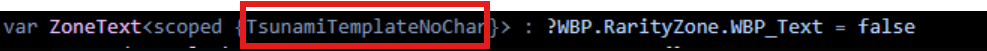
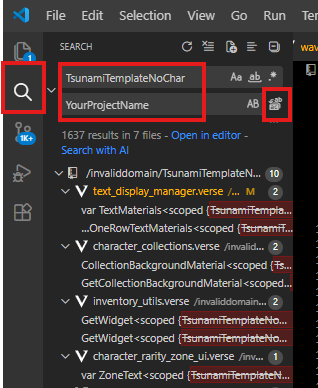
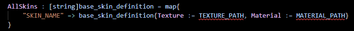
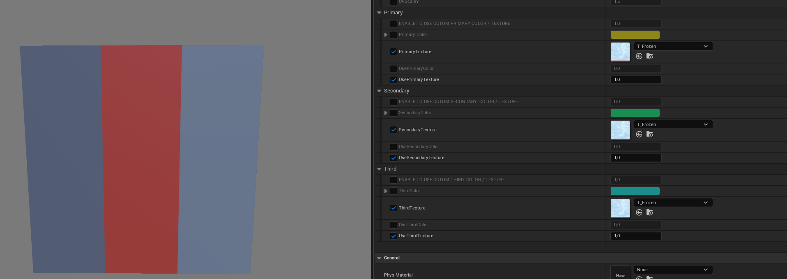

 
# Grow A Beanstalk Template

## Table of Contents

- [Overview](#overview)
- [Setting up characters](#setting-up-characters)
- [Setting up collections](#setting-up-collections)
- [Changing prize wheel](#changing-prize-wheel)
- [Adding new audio effects](#adding-new-audio-effects)
- [Adjusting the economy](#adjusting-the-economy)
- [Setting up secret codes](#setting-up-secret-codes)
- [Changing daily rewards](#changing-daily-rewards)
- [Changing playtime rewards](#changing-playtime-rewards)
- [Adding new base skins](#adding-new-base-skins)
- [Setting up live events](#setting-up-live-events)
- [Making changes to the UI](#making-changes-to-the-ui)
- [Using Asicson's dynamic material](#using-asicsons-dynamic-material)

## Overview
This is the documentation guide for Delta UEFN's Grow A Beanstalk template. Almost everything is handled in Scene Graph, except for a single Verse device used to handle player spawning more effectively. In this setup guide we'll explain how you can customize the template to your liking, and most important of all; set up your own characters.

## How to install template?

1) Open the folder where Fortnite is installed. And open “FortniteGame” folder

2) Create a new folder called “VKTemplates”, And open it

3) Inside the “VKTemplates” folder, Create a new folder called “Basic”, and open it

4)  Drag the “BeanstalkTemplate” folder into it

5) Open UEFN Editor

6) Now, click on the "feature example" category, A new template called "BeanstalkTemplate"
should appear, click on it and create the project. And then, you should now have access to the project!

## Known issue /!\
 
Upon opening the project for the first time, you will see errors related to Verse. Simply click `Open VS Code`, and then in VS Code click `Ctrl + Shift + F` which will take you to the search menu.
 
The errors are related to some variables and constants scoped at the project level, because of issues with certain materials. 

 
To fix this, type in the top box `BeanstalkTemplateNoChar`, and in the bottom box your project name. Then click the `Replace All` button. After this close out of VS Code, and click the blue `Rebuild` button. If you still have invisible bases or any similar issues, close and open the map.

## Entities
 
The main thing to remember is that the `Entities.EP_Game` file is the "main" game handler. This is an entity prefab, which means it's different from an entity placed down on the map. If you open this, you'll see the main mechanics of our game, like the live event, different buttons etc. If you want to make changes to the mesh for the keypad button for example, make sure to change it in the `Entities.EP_Keypad` prefab, and it will automatically change everywhere. Similarly, if you want to make changes to how the slots look, don't change it in the EP_Base, but in the EP_Slot prefab. This is because you should always change the most "specific" prefab so others that use this will be updated automatically. 

## Setting up characters
One thing to note before you start setting up your characters, is how their material is made. If all of your characters have 1 global texture where they get their colors from, this is the easiest, so if you're still picking your character pack go for one that has this. Alternatively each character can have its own texture, which is also easy to handle. Though if they have e.g. 5 different material slots and these consist of only a color, it will take the longest.

Because we use Scene Graph for the characters, they will need to have animated textures to play animations on static meshes. For this, you will need to install `Unreal Engine 5`. Alternatively, you can just use static meshes without animations. I'll link two guides below, one general on UE5 and one by Map Academy specific to UEFN: 
- [Create Animated Materials For Any Mesh - YedesCodes](https://www.youtube.com/watch?v=w7oq8nga4bE)
- [Make Custom Characters in Fortnite UEFN! - Map Academy ](https://www.youtube.com/watch?v=0YPwd0d9fwo)
</ul>

After you have your static meshes, go into the Characters folder and find the `EP_Example1` entity prefab. Duplicate this and change the static mesh to your character's mesh. If you can't locate your character's mesh make sure to build Verse code first. Make sure all of the characters' individual material instances are parented by the `MakeAnim` material. This is used for the different collections. 

Then, open the Verse project in VS code to change the setup of the characters. We decided to do it this way, as it is easier to change the characters and sort them in a code editor, rather than a Verse device or Scene Graph component. Open the `Scripts.GameCharacters.Instances.uncommon_characters.verse` file. In here, you'll see the characters we have already set up, and theoretically you can just change the names, the entity prefab and the texture. Here you can also change the base money/s and the weight of this character within its rarity.

 
To make the character's texture, open the entity prefab in UEFN, and position the camera to get the character in your desired view. Take a screenshot, paste it in a Photoshop/Affinity/Gimp/Photopea `512x512` transparent file and use the select tool/magic wand/fuzzy select tool to remove the background. Then, export and import into UEFN, preferably into the Textures.Characters folder. Update the texture references in the uncommon_characters Verse file. Afterwards you can do the same for the other rarities, and your characters will be set up. If you notice that your characters have the incorrect rotation, go into the `Scripts.Components.base_component.verse` file and change the `GlobalCharacterRotation`'s yaw value (located at the top).

Now, for the most annoying part of setting up the characters, changing the character functions. Unfortunately this is necessary because scene graph does not allow for these functionalities yet, and there is simply no other way to do it with the setup we have. Locate the `Scripts.GameCharacters.Instances.character_data.verse` and scroll to the bottom. There will be 3 functions here; `MakeMaterialFromCharacter`, `SetCharacterMaterial` and `UpdateMaterialFromCollection`

The first one, `MakeMaterialFromCharacter`, is needed to make a new instance for each character's material, so they don't conflict with each other. Simply add a new line, enter the name of the character (case-sensitive) as a string, followed by => the path to the material. This makes `"Bananini" => Brainrots.Basic.Chimpanzini_Bananini.MI_Bananini_Anim{}`

For `SetCharacterMaterial`, copy one of the lines, and change the first part the path of your mesh, and the second part to it's `material slot = Material`. To make it easy just copy what is done in other examples.

And the longest one; `UpdateCharacterFromCollection` is used to update the values of this material instance. Change the paths to your mesh and material for each character.

Also update the directory.verse file with the updated folder names. Just add them instead of Example1 and Example2 and keep adding to this list.

## Setting up collections
Changing the collections is also easy. Locate the `Scripts.GameCharacters.Collections.character_collections.verse` file. Here you can change the collections' names, multiplier, and its index colors (used in index). Make sure to also change the `ecollection` enum contents located at the top of the file. After changing these you will get errors in other scripts, but these are easy to change. Locate the lines where it indicated the errors, for example the ToColor function, and change the contents. Just change it to `ecollection.Diamond => ...`, or whatever you name your collection. The actual ecollection enum is not player facing, and it's just for the code, though it is recommended to change this.

 
There are already different VFX set up per collection, but of course you can change these to your liking. By default these will be located in the VFX folder, and it will be one for each collection. To change the reference for each collection in Verse, find the `ToVFX` function (use `Ctrl+Shift+F` to find the function). Here you can update to the new references. 

 
To change the color displayed on each character open MakeAnim material mentioned before. Here a different number indicates a different collection. They are already set up for the different collections we have, but to add make sure to also add it in the ToInt function, which converts each collection to an integer. Then, in the MakeAnim material copy one of the other collections, and add it to the Switch node.

## Changing prize wheel
 
To set up live events, find the `EP_Game` in the outliner (so this is the instance, not the prefab in content browser), and find the `EP_Prize_Wheel` prefab in here. In its `prize_wheel_manager_component` you can set up the different weights and rewards. To change the look of the wheel, simply open the prefab for the `EP_Live_Event` and change the materials used. To make a new material like the ones we have, simply make a material instance of one of the other materials and update the texture, icon and colors. 
>Note that changing these settings in the prefab will change it for all instances/spawned of the prefab, and changing it in the editor will change it for that one only. 

## Adding new audio effects
To add new audio effects, locate the `Scripts.Components.audio_component.verse` file. Here, add the `@editable` for the audio_player_device, and the AwaitAudioEvent in the `InitializeAudioEvents()` function, just like the others. Also, in the `Scripts.EventManager.audio_event_manager.verse file`, add an event this new audio, this should fix the errors. 

 
Then, anywhere in a script use the following; `GetEvent().AudioEvents.SlapHitAudioEvent.Signal(Agent)`, but replace `SlapHitAudioEvent` with the name of your event, and your audio will play. Make sure to add it in the `EP_Game` instance's `audio_component` in the outliner, just duplicate one of the `audio_player_devices` and enter it here.

## Adjusting the economy
 
First of all, you can start by changing the characters' money/s base amount, and the collection multipliers. To change other aspects of the economy, locate the `Scripts.economy.verse` file, where everything is stored. Here you can change values such as the upgrade character curve, the base upgrade curve and the speed shop curve.

To change the costs of the entitlements (in-game-purchases) like the wave shop and the speed shop, find the `Scripts.Manager.EntitlementFolder` folder, where multiple scripts are stored. 

- Changing name, description, short description: `entitlement_info.verse`
- Changing price, icon: `entitlement_offers.verse`
- Other info about entitlements: `entitlement_definition.verse`
</ul>

## Setting up secret codes
To add secret codes, find the `Scripts.Components.keypad_component`.verse file. In here, just copy one of the other elements of the CodeRewards array and add it after the last one (make sure to add a comma ","). You can change the code (max 8 numbers), the max usage and the reward. For these rewards you can pick any of the following:

- `reward_cash` (gives cash to player)
- `reward_speed` (upgrades their speed level)
- `reward_inventory_character` (adds character to inventory)
- `reward_guaranteed_character` (spawns character on map)
- `reward_guaranteed_rarity` (spawns character of this rarity on map)
- `reward_base_skin` (gives player this base skin)
</ul>

 
This reward system is used everywhere across the map, so if you add another one here (subclass of `reward`, and override the `Claim` function) you can use it for other things too such as playtime rewards.
> Note that there have been claims that maps get denied because their secret codes are only available through third party platforms (like Discord). The fix to this is to add a billboard very small somewhere at the edge of your map with this secret code.

## Changing daily rewards
Changing the daily rewards is very easy. Go into the `EP_Game` instance on your map and locate the `EP_Daily_Rewards`, which has the `daily_rewards_component`. Here you can change the rewards to whatever you want. Make sure there are exactly 7 elements to this array, so one for every day. Changing the texture in here will also affect the texture used in the daily rewards screen.

 
To change the slot's background color, you can do this in the Verse file. If you wish to add more colors to this, change it in the `Scripts.Components.daily_reward_component.verse` file (the enum and the map). Changing the look of the slot itself (such as the background or the animation) can be done in `WBP.DailyRewards.WBP_DailyRewardSlot`, either the small one or the large one. Changing the small one will automatically affect all small ones. 

## Changing playtime rewards
Playtime rewards work similar to the daily rewards, and changing them is the same. Locate the `playtime_rewards_component` inside of the `EP_Daily_Rewards` placed on the map, and here you can change the rewards. 

> Note that you can also change the time for each reward (in seconds).

To change the look of each slot (for example the background), find the `WBP.PlaytimeRewards.WBP_PlaytimeSlot` widget blueprint. If you change the slot in here, it will affect all of the slots, the same goes for the header, which will automatically update. 

## Adding new base skins
 
To add/modify the base skins, go to `base_skin_changer_component.verse`. Once you are in the file, you will find a list of all the skins that we have already pre-filled for you. Each element contains the name of the skin and the data related to it. In the base_skin_definition object, you must reference the texture and the material. Simply reference the path where your texture or material is located. 

So, here's how a line in this list is supposed to be constructed:
 

## Create a new instance of the base skin material
 
To create a new instance of the base skin material, you must go to this path: `BeanstalkTemplate > Meshes > BaseMeshes > MaterialInstances` (*1). Once you have navigated to this path, you can view the material instances that we have already prefabricated. To create a new one, simply right-click (*2) on one of the existing materials and then create a material instance.

## Customize a base skin material
Once your material instance has been created, double-click on it to open it.

Here is how the UVs of the base mesh are composed, and this applies to all three levels of the base (see photo below).
 

Once you understand how the system works, it is easier to understand how the material instance parameters work.
Thanks to this material, you will be able to change the color for numbers 1, 2, 4, and 5, or even add an animated texture of your choice.
To do this, simply check the `ENABLE TO USE CUSTOM COLOR / TEXTURE` parameter. Once this parameter is enabled, you must enable either `UseColor` and set the value to `1.0` if you want to use a single color, or `UseTexture` and also set the value to `1.0` if you want to use a texture. When you enable these parameters, the texture on the square where the mesh UVs are mapped is replaced by the one you added.

 

## Setting up live events
 
To set up live events, find the `live_event_component` in the EP_Game instance. Here you can change the updated weights during the event, the event duration, interval and material.

## Adding new live event material
In the same way as creating a new instance of a base skin, go to this path: `BeanstalkTemplate.Meshes.World.Landscape`
Here you can view the materials we have prefabricated. To create a new one, simply create a new instance of `M_BaseMat`.

 

Once the instance has been created, you can double-click to open it and you will find these parameters:

The system works exactly the same as for the base skin. You can choose to replace a square of the texture with a color or a texture.
Here is the UV mapping diagram. You can, of course, draw inspiration from existing material instances to better understand how it works.

Once your material instances have been created, you can now fill them in the respective fields of the live_event_manager_component component. To do this, simply go to the `EP_Game > live_event_manager_component` and fill in the `LandscapeMaterial` field.

 

## Making changes to the UI
Because UEFN is kind of in a state between Verse UI and UMG, we had to use a combination of both. For more freedom of animations, like the rebirth menu, we picked to go with UMG. On the other hand, a lot of repetitive slots and buttons, like the trading/inventory, are "built" with Verse. 

 
This means that a singular inventory slot is just a widget blueprint, but these are put together to form an inventory through Verse, which makes it easier to handle the events. So for the UI like the trading, inventory, trade ups and secret codes, you will have to change the particular individual slot to change all of them. Some of them will still have a WBP in their folder, which shows how it will look in-game, but changing this will not change anything. If you have a question about a particular piece of UI, feel free to ask.

But, the ones that will be easier to change, such as the currency, rebirth, notifications, wave shop and speed shop are done through UMG. For these, locate the WBP in their designated folder inside of the WBP folder. The individual WBP's are usually named something along the lines of `WBP_Speed_Shop`. In here, everything you change will be automatically reflected in game. Though, removing and adding text blocks for example will mean that the UMG binding that is here will be lost. Therefore just change the text size/color etc. in the text block that is already there, and it will stay intact.

## Using Asicson's dynamic material
 
This template includes Asicson's dynamic material, and he gets a share of each purchase for this template. This dynamic material is very useful for these types of games, as it constructs the text itself, without any extra textures. For example a tycoon game would not require hundreds of textures for the upgrades, but just this material.

In the files you will receive there will also be a standard version of the dynamic material, but ours in the game is a bit adapted. We changed the code a bit to make it work for one line materials, and to make it work with entities. We also changed the font to Nunito 900. View Asicson's tutorial linked below on it to see how you can use it in other projects too! 
[Custom Text System for Any Need - Asicson](https://youtu.be/_9YQt7tWor8)
