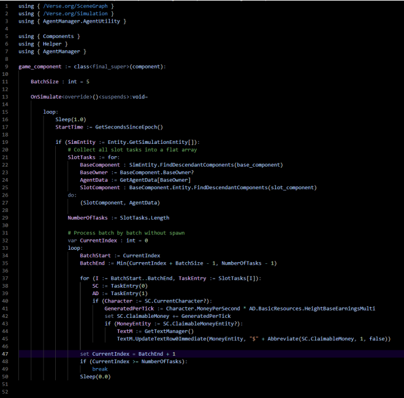
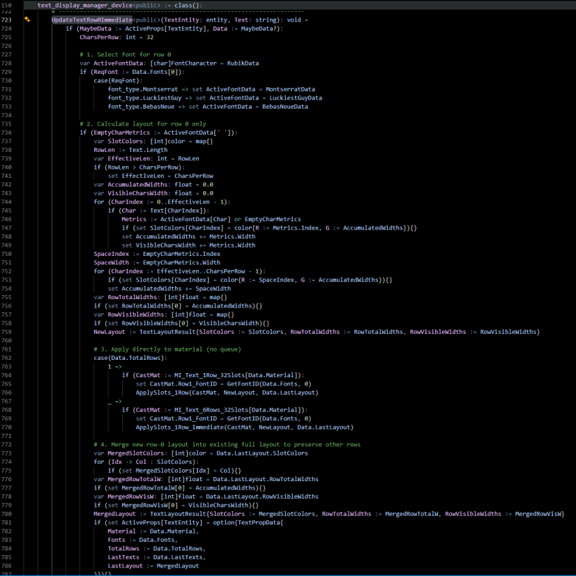
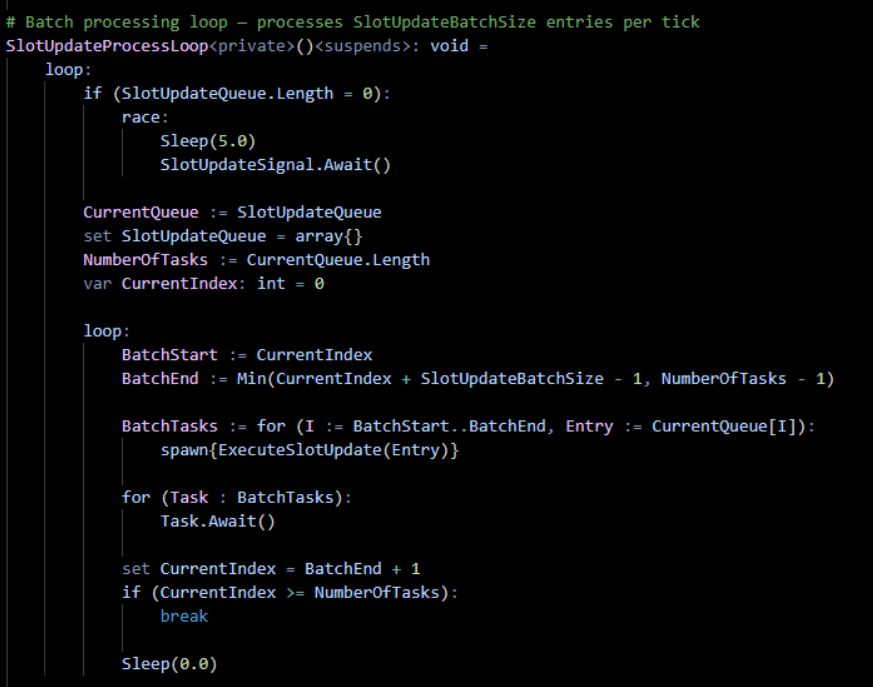

# Grow A Beanstalk — Stuttering Issue Fix

This guide walks you through the steps to fix the stuttering issue.

---

## Step 1 — Replace `game_component.verse`

Open `game_component.verse` located in **Scripts > Components > game_component.verse** and replace all its content with the one provided in the `.zip` file.

Your file should look like this:

> [!NOTE]
> An error should appear at `TextM.UpdateTextRow0Immediate` — this is expected and will be fixed in Step 2.

---

## Step 2 — Add `UpdateTextRow0Immediate()` to `text_display_manager.verse`

Open `text_display_manager.verse` located in **TextMaterial > text_display_manager.verse** and add the `UpdateTextRow0Immediate()` function provided in the `.zip` file.

This should fix the `game_component.verse` error from Step 1.

---

## Step 3 — Replace `SlotUpdateProcessLoop()` in `text_display_manager.verse`

In the same file (`text_display_manager.verse`), replace the `SlotUpdateProcessLoop()` function with the one provided in the `.zip` file.

It should look like this:

